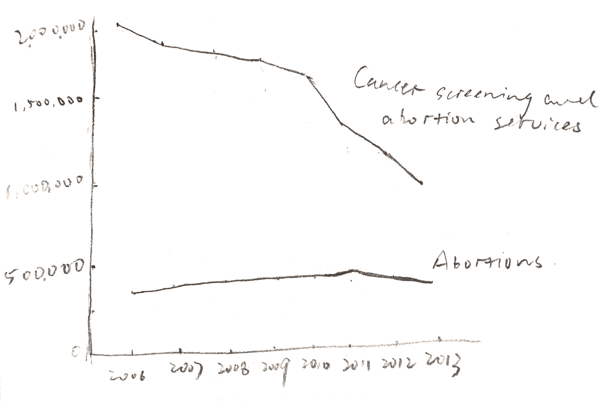

# Critique by Design
In this assignment, I was asked to choose a data visualization, do a critique on it and make some redesign around it. The visualization I found is this, a chart showing the rate of abortions and that of prevention services from 2006 to 2013 at Planned Parenthood, a nonprofit organization that provides reproductive health care in the United States. [Here](https://thefederalist.com/2015/09/30/at-planned-parenthood-abortion-is-up-health-care-is-down/) is the link to the original chart.

## First impression
The data visualization is easy-to-understand, with two simple arrows showing two contrasting trends. It is able to deliver its idea intuitively to the audience: from 2006 to 2013 at Planned Parenthood, the rate of abortions is going up and that of prevention services is going down.

However, it is presenting misleading information to the audience, which takes a second look to see the trick. The chart is missing a Y-axis and everything was not plotted to scale. On the right, 935,573 is a much larger number than 327,000, so the pink line should be above the red one.

As I dug into the source of this visualization, I found that it was created by United For Life, an anti-abortion organization, to attack its nemesis Planned Parenthood. For those who have a neutral opinion towards abortion but are less familiar with data visualization, this chart may easily irritate them if they don't look closely. It is even used by a Utah Representative Jason Chaffetz who [tried to defund Planned Parenthood]( https://www.youtube.com/watch?v=z6MHjz9nIns).

## My process to redesign the chart
First and foremost, I looked up and found the origin of the data, scattered in many annual reports from Planned Parenthood, including [2010](https://liveaction.org/research/wp-content/uploads/2011/06/2009-2010-Planned-Parenthood-Annual-Report.pdf), [2012](https://www.plannedparenthood.org/files/4913/9620/1413/PPFA_AR_2012_121812_vF.pdf), [2013](https://www.plannedparenthood.org/files/7413/9620/1089/AR-FY13_111213_vF_rev3_ISSUU.pdf) and [2014](https://www.plannedparenthood.org/files/6714/1996/2641/2013-2014_Annual_Report_FINAL_WEB_VERSION.pdf). The data is displayed below:

| Year | Abortions | Cancer Screening & Prevention Services |
|------|-----------|----------------------------------------|
| 2006 | 289,750   | 2,007,371                              |
| 2007 | 305,310   | 1,900,850                                |
| 2009 | 331,796  | 1,830,811                               |
| 2010 | 329,445  | 1,596,741                               |
| 2011 | 333,964  | 1,307,570                                |
| 2012 | 327,166  | 1,121,580                                |
| 2013 | 327,653  | 935,573                               |

Then I added a Y-axis, put things back to scale so everything is more comparable. Here is a wireframe of my solution:

## Feedback from users
I asked two people to examine first the original chart and then my wireframe. In order to minimize the effect of education on understanding the chart, I chose one friend of mine with an advanced degree in engineering and one family member with a high school degree.

For the original visualization, I asked what are the things that caught their eye, from the first to the last. Both of their attention were grabbed by the colored, all-capped words on the line and saw the trend immediately. Then they moved eyes to the title, which gave some context. In the end, they saw the numbers at the end of the two arrows and felt totally confused. They both mentioned that putting 327,000 above 935,573 did not make sense at all. As for the Y-axis, my friend was able to spot that it was missing, while my family member was not.

For my redesign, they both said that adding a Y-axis is helpful, since "it makes more mathematical sense" as my friend suggested. Also, plotting the line based on each year's data gave more detail to the chart. My friend suggested adding more ticks on the Y-axis, to better display value on "abortions".

Interestingly, my family member preferred the original visualization, since "although exaggerated, it was able to showcase the trend of the two things and I can understand it as soon as I saw the chart". While my revision was more correct, it is not as eye-catching as the original.

## Final visualization
Based on the feedback from users, I created my final visualization.
<iframe title="Services provided by Planned Parenthood" aria-label="Interactive line chart" id="datawrapper-chart-vtHM5" src="//datawrapper.dwcdn.net/vtHM5/1/" scrolling="no" frameborder="0" style="width: 0; min-width: 100% !important; border: none;" height="574"></iframe>
