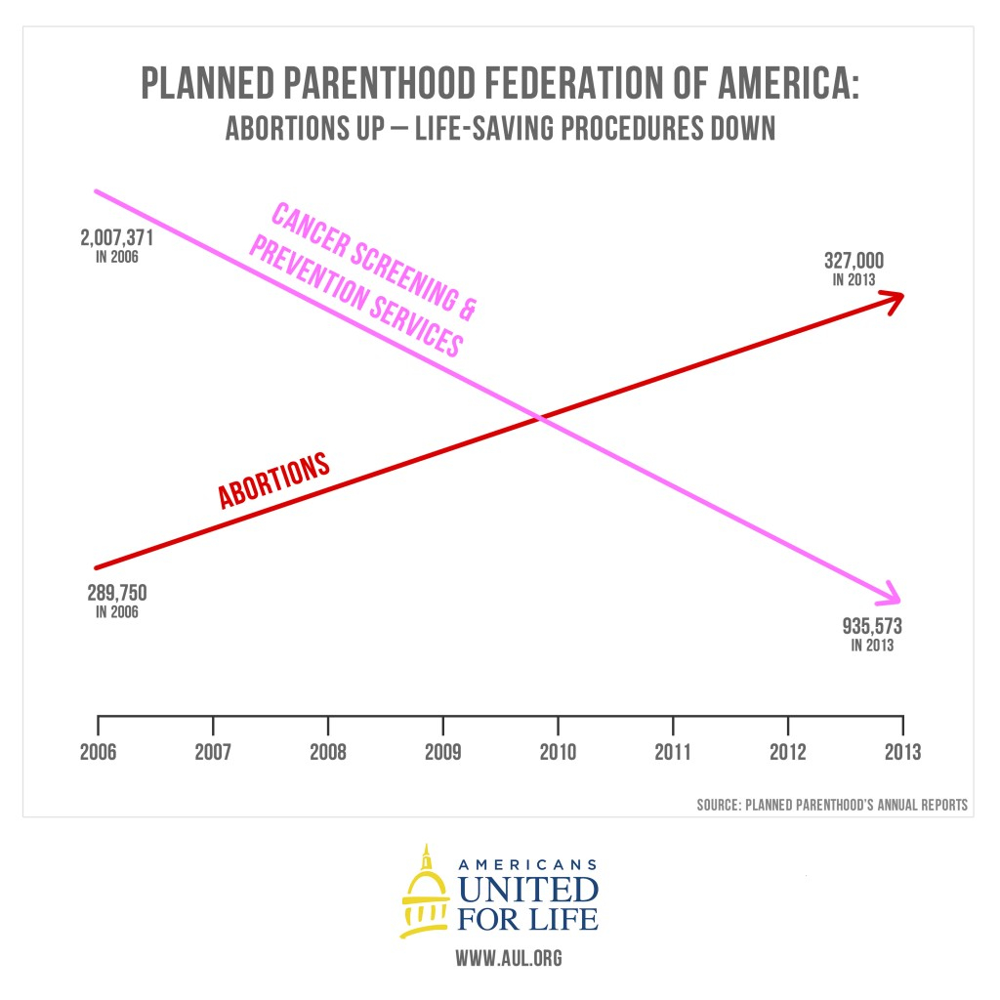

# Critique by Design
In this assignment, I was asked to choose a data visualization, do a critique on it and make some redesign around it. The visualization I found is this, a chart showing the rate of abortions and that of prevention services from 2006 to 2013 at Planned Parenthood, a nonprofit organization that provides reproductive health care in the United States. [Here](https://thefederalist.com/2015/09/30/at-planned-parenthood-abortion-is-up-health-care-is-down/) is the link to the original chart.

## First impression
The data visualization is easy-to-understand, with two simple arrows showing two contrasting trends. It is able to deliver its idea intuitively to the audience: from 2006 to 2013 at Planned Parenthood, the rate of abortions is going up and that of prevention services is going down.

However, it is presenting misleading information to the audience, which takes a second look to see the trick. The chart is missing a Y-axis and everything was not plotted to scale. On the right, 935,573 is a much larger number than 327,000, so the pink line should be above the red one.

As I dug into the source of this visualization, I found that it was created by United For Life, an anti-abortion organization, to attack its nemesis Planned Parenthood. For those who have a neutral opinion towards abortion but are less familiar with data visualization, this chart may easily irritate them if they don't look closely. It is even used by a Utah Representative Jason Chaffetz who [tried to defund Planned Parenthood]( https://www.youtube.com/watch?v=z6MHjz9nIns).

## My thought process to redesign the chart
First and foremost, I added a Y-axis, put things back to scale so everything is more comparable. Then I looked up and found the origin of and change the title so it is less misleading.

## Feedback from users
test test
