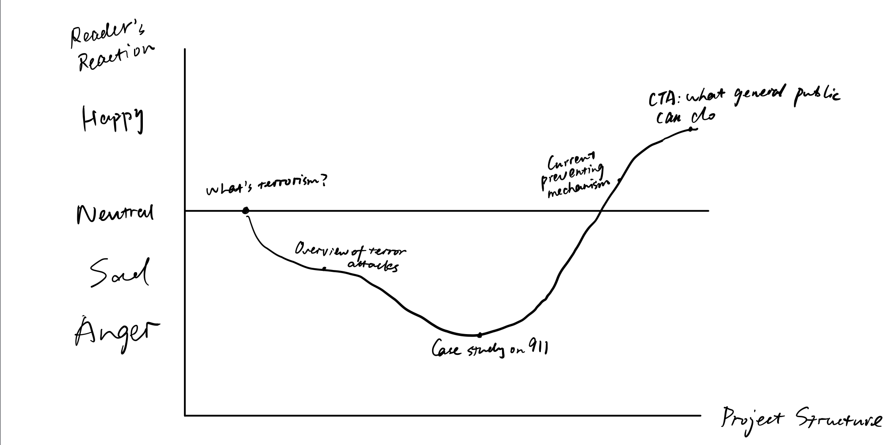

# Final Project proposal
## Project Summary
This final project will look at the Global Terrorism Database, an open-source database with information on terrorist attacks around the world from 1970 through 2017, putting the statistics of terrorist attacks in context and help readers understand terrorism better.

## Project Structure
1. What is terrorism?
2. Terrorism is more dreadful than you think: An overview of terrorist attacks over the years
3. Countries with the least and most chance of being hit by terrorism
4. A small case study on 911
5. Current mechanisms on preventing terrorism
6. Call to action: what general public can do to oppose terrorism and possibly avoid terrorist attack

## Initial Sketches

## Data
This project will utilize the open-source database found from Kaggle. You can view the dataset [here](https://www.kaggle.com/START-UMD/gtd).  
This is a huge dataset with 100 columns. At first glance, I plan to use columns with geographic information (latitude and longitude) and timestamps to plot the past terrorist attacks onto a map.

## Method and Medium
I would like to use Python libraries like [Bokeh](https://github.com/bokeh/bokeh) and [Altair](https://github.com/altair-viz/altair) to plot geographic data. I also want to explore ways to make the final presentation interactive, enabling the readers to play around the data visualization.  
For the platform, I am thinking about [Observable](https://observablehq.com/) since I like its simplicity and elegancy in displaying data visualizations.
