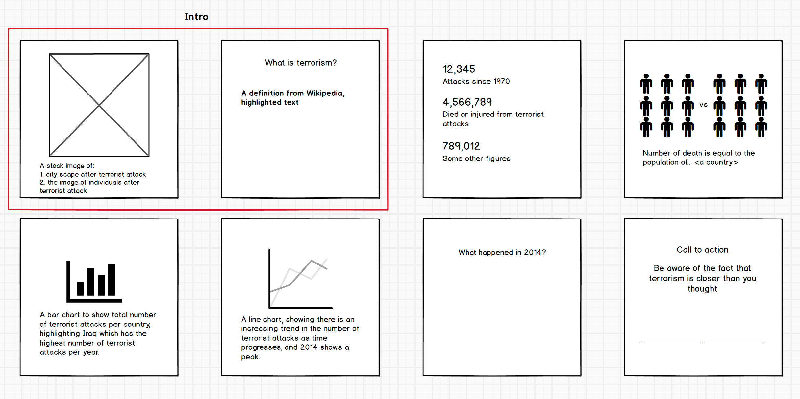
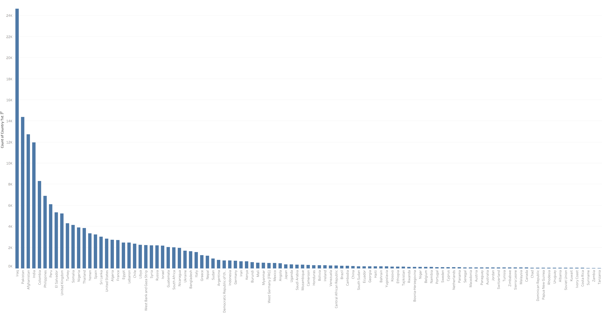

# Final Project, Part II: Storyboards, user research and wireframes
My topic is about terrorism and the main goal is to help people understand terrorism better through the lens of statistics and data visualization. I wanted to start with giving readers a general theme of terrorist attacks by presenting figures and trends, then scope down to data points that are specifically interesting. At the end, I would like readers to understand that terrorism is not far from their ordinary lives, but rather widespread across the globe, and provide some tips and tricks to identify potential terrorism signals both online and offline.  

## Storyboards

After I looked into my [dataset](https://www.kaggle.com/START-UMD/gtd), I found that there was an rather smooth increasing trend in the number of terrorist attacks as time progressed from 1970 to 2011, yet after 2011 the number rose drastically until in 2014 reached a peak.  

## User research protocol
### Target audience
The target audience for this final project will be anyone who has heard of or even experienced terrorist attacks but was not exposed to relevant statistics of terrorism. For most people, 911 is the one that happened in their life, but there are much more terrorist activities happening around the globe, and this presentation aims to bring attention to these activities.

### Approach to identifying representative individuals to interview  
To select people to interview and critique my wireframes, I was thinking of people from different ethnicity and/or countries. I reached out to three peers in my master program (one Chinese, one Turkish and one Indian) and one undergraduate from a data science class (White American).

### Interview script  
Since this project's goal is to raise people's awareness of terrorism by showcasing relevant data, my interview questions focused on: people's impression of terrorism before and after they examine my wireframes.
1. General knowledge
- What are your first impression when you hear about the term "terrorism"?
- Do you you know any numbers or figures about terrorism?  

2. Overall impression of wireframe
- Can you describe what the story is telling you?
- Is there anything that you find surprising or confusing?

3. Intro
- Which stock image do you prefer to see at the very beginning of the story and why?
- Is there anything that you think is missing from the intro?

4. statistics
- What data do you expect to see that reflects how widespread terrorism is?

5. Graph and visual
- Do you think the current graphs are understandable to you? If not, what kind of graphs do you prefer?

### Findings from interview
From the interview, most people were able to follow along my storyline. However, some of them think the connection between call-to-action and the previous content seemed a bit weak.

**Intro**  
For the intro image, out of 4 interviewees, 3 preferred an image of individuals after terrorist attack and 1 preferred a picture of city scape after terrorist attack. 1 person mentioned that it largely depended on what my end goal is: to raise people's awareness of terrorism, a picture of individuals may be more relatable to the general public than a city scape.
> I would go with an image of individuals because although a devastated city look shocking, people may think that oh this is horrible but it's not my hometown, you know, so it is less relatable.

**Trend in 2014**  
Most interviewees were interested in what happened in 2014 that caused such an hike in the number of terrorist attacks. 3 people mentioned that I can look into social and economical factors that contribute to this phenomenon.

**What else do you like to see in the narrative?**  
One interviewee mentioned she wanted to see more about the influence that terrorism groups are trying to make through new channels, like social platforms and media outlets.
> The Islamic State uses social media to promote its beliefs and attract newcomers, especially younger generation. How did they do this? I would like to know more data about that.

Another suggestion is related to the connection between call-to-action and content mentioned above. Two interviewees said it was unclear how terrorism is close to the public.
>People know about terrorism by their names and locations, but they feel like it's quite far from their lives. Maybe you can find some data to show like there's one terrorist in every 100 or so people.

**Graph and visual**  
For the total number of terrorist attacks per country, I opted for a bar chart at the beginning, as shown below.

One interviewee commented that although bar chart can show the drastic difference between Iraq and other countries, he wanted to know how the top countries were geographically located.

### Wireframes
Based on the feedback I collected, I did the following changes.  
I recreated the graph of the total number of terrorist attacks per country using heat map on a world map to indicate difference in regions. Then I linked the heat map with another bar chart, showing types of attacks in these years. I also created a interactive bar with which the readers can interact with to see the number of terrorist attacks adds up as time moves forward.
<iframe src="https://public.tableau.com/views/Terroristattacks_15746600294590/Countriestypesoveryear?:display_count=y&:origin=viz_share_link&:showVizHome=no&:embed=true" width="955" height="955"></iframe>
I also added a band between 2011 and 2017 to highlight the rapid rise after 2011.
<iframe src="https://public.tableau.com/views/Terroristattacks_15746600294590/No_ofattacksperyear?:showVizHome=no&:embed=true" width="955" height="955"></iframe>

### Next step
As suggested by interviewees, I will look into economic and social factors that may contribute to the 2014 outlier. I also want to examine some terrorism on the Internet examples, so that my call to action can be better linked with the content.  
Also, I found that the play and pause, forward backward and speed control are available in Tableau Desktop but disabled in Tableau Public and Server. Without this feature, readers have to click once for every year, which is less ideal, and it seems [many](https://community.tableau.com/ideas/3844) [people](https://community.tableau.com/ideas/1201) have been complaining about this for years. I will try to find a workaround for this.
